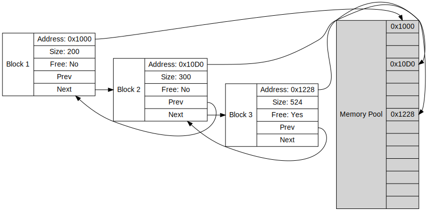

### **Objective:**

The goal of this assignment is to implement a memory management system using a doubly linked list. You will create a memory allocator that allows memory blocks to be allocated and deallocated dynamically, keeping track of free and used memory blocks.




### Assignment Requirements

Create a program that simulates memory allocation and deallocation using a doubly linked list. Each node in the list represents a block of memory, which can either be allocated or free. Your program should be able to allocate and deallocate memory, and also merge free blocks when possible.

You are required to implement the following functionalities in C:

1. **Memory Initialization**: Initializes the memory pool with a single large block of the specified size.
2. **Memory Allocation**: Allocates a block of memory of the specified size from the memory pool.
3. **Memory Deallocation**: Free memory and merge adjacent free blocks.Frees a previously allocated block of memory and merges adjacent free blocks to minimize fragmentation.

### **Detailed Specifications:**

1. **Structure for Memory Block**:
    - **`Block`**: Represents a memory segment, storing:
        - `size`: The size of the block.
        - `is_free`: Indicates whether the block is free or allocated.
        - `address`: Points to the start of the block's allocated memory.
        - `next` and `prev`: Pointers to the next and previous blocks in the doubly linked list.
    - **`Memory`**: Manages the memory pool, containing:
        - `head`: A pointer to the first `Block` in the list.
```c
typedef struct Block Block;
typedef struct Memory Memory;

struct Block {
    size_t size;               // Size of the block
    int is_free;               // Block status: 1 for free, 0 for allocated
    void *address;             // Address of the allocated memory
    Block *next;        // Pointer to the next block
    Block *prev;        // Pointer to the previous block
};

struct Memory {
    Block *head;               // Head of the doubly linked list
};
```

### **Function Prototypes and Descriptions**

1. **`void init_memory(Memory *memory, size_t total_size);`**
    - **Purpose**: Initializes the memory pool with a single large block of the specified size.
    - **Parameters**:
        - `memory`: A pointer to the `Memory` structure, which manages the memory pool.
        - `total_size`: The total size of the memory pool to initialize.
    - **Behavior**:
        - Allocates a single `Block` structure to represent the entire memory pool.
        - Marks the block as free and initializes its address with the starting memory location of the pool.
2. **`void* allocate_memory(Memory *memory, size_t size);`**
    - **Purpose**: Allocates a block of memory of the specified size from the memory pool.
    - **Parameters**:
        - `memory`: A pointer to the `Memory` structure managing the memory pool.
        - `size`: The size of the memory block to allocate.
    - **Returns**: A pointer to the allocated memory block or `NULL` if insufficient memory is available.
    - **Behavior**:
        - Searches for a free block large enough to satisfy the allocation request.
        - Splits the block if it is larger than the requested size, creating a new `Block` for the remaining memory.
        - Marks the allocated block as "not free" and returns its address.
3. **`void free_memory(Memory *memory, void *ptr);`**
    - **Purpose**: Frees a previously allocated block of memory and merges adjacent free blocks to minimize fragmentation.
    - **Parameters**:
        - `memory`: A pointer to the `Memory` structure managing the memory pool.
        - `ptr`: A pointer to the start of the block to free.
    - **Behavior**:
        - Marks the specified block as free.
        - Merges it with adjacent free blocks, if applicable, to reduce fragmentation.

### Makefile Usage Guide

This `Makefile` provides targets for compiling, running, and cleaning up a C project that involves running sample test cases for a linked list.

### Makefile Targets

1. **`clean`**
    - **Usage**: `make clean`
    - **Description**: Removes all compiled object files (`$(OBJS)`) and the final executable (`$(TARGET)`).
    - **Example**:
        
        ```bash
        make clean
        ```
        
2. **`check-%`**
    - **Usage**: `make check-<test_case>`
    - **Description**: Runs a specific test case with the compiled executable, `$(TARGET)`.
        - Replace `<test_case>` with the desired test case argument.
        - Displays messages indicating the start and success of each test.
    - **Example**:
        
        ```bash
        make check-1  # Runs test case 1
        make check-2  # Runs test case 2
        ```
        
3. **`sample`**
    - **Usage**: `make sample`
    - **Description**: Compiles the main source files (`$(OBJS)`), along with `sample_test_case.o`, and generates an executable called `test_sample`.
    - **Example**:
        
        ```bash
        make sample
        ./test_sample  # Runs the compiled sample test executable
        ```
        